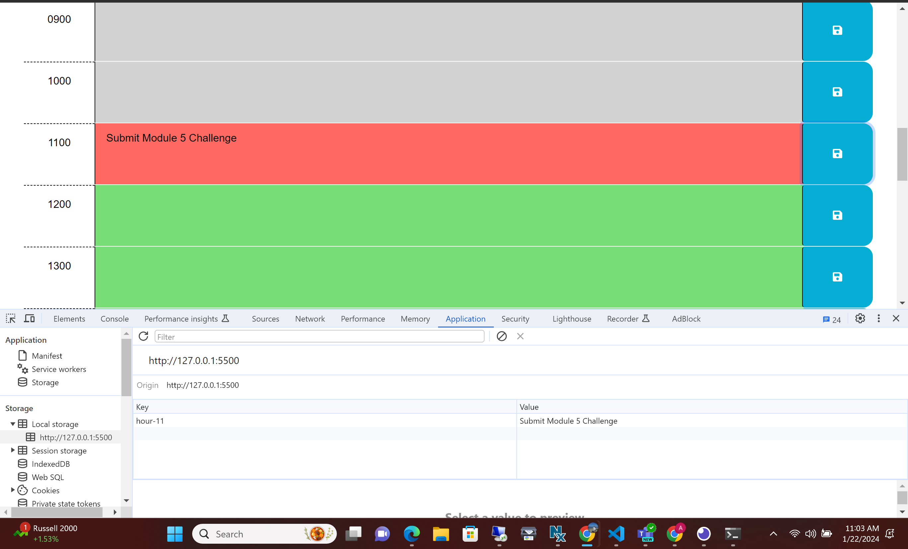

# Life Organized

## Challenge

We were tasked to modify a website (given starter code) that could be used as a daily task tracker. The site needs to track the current time accurately, allow the user to input text into each hour slot, save that text into local storage, and use color coding to visual track which hour it currently is.

## Current Site

As of right now:
- When you refresh the page, the text in the hour slots disappears but is still saved in local storage. 
- There is no login option
- The CSS is very basic
- The color sceme for the hours is not ideal

## Future Site

I would like to:
- Add a login ability so you can save your information.
- Modify the color pallete and upgrade the CSS in general.
- Add Weekly and Monthly views
- Simplify the code to eliminate the 24 seperate hour slots and condense the code.

## Links

GitHub: https://github.com/anplace/Life-Organized
Deployed Site: 